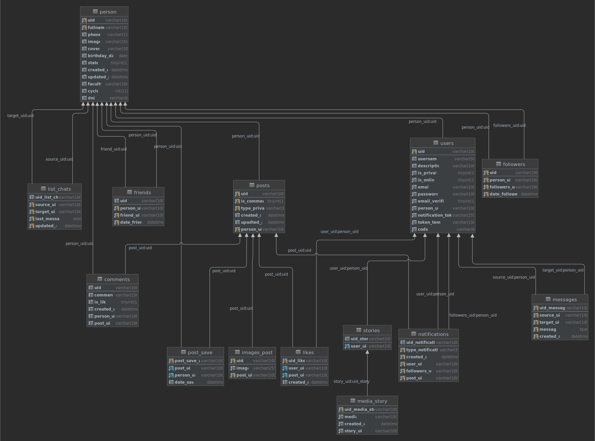

# Descripción de los Tablas en la base de datos Red-Estudiantil

## Diagrama de base de datos

## Persona
Tabla `person`,encargada de guardar la información personal del usuario: datos de identificación personal,académica e imágen de pérfil).
Es la tabla con mayores relaciones. Está presente como un campo foráneo es las siguientes tablas:
- `list_chats`
- `comments`
- `friend`
- `posts`
- `posts_save`
- `users`
- `followers`

## Usuario
Tabla `users`, encargada de guardas las credenciales de acceso y datos de validación de registro que está asociado a la tabla `person`,además de guardar token de asociación.

## Seguidores
Tabla `followers`, es una lista de usuarios que están asociados a una fila de `person`.

Nota: Los seguidores de una persona son también personas,por lo tanto hay una relación de llamada a si mismo.

## Amigos
Tabla `friends`, es una lista de usuarios que están asociados a una fila de `person`,indicando una asociación de amistad.

Nota: Los amigos de una persona son también personas,por lo tanto hay una relación de llamada a si mismo.

## Publicaciones
Tabla `posts` es una lista asociada a filas de `person` que contiene todos los posts hechos por este.

## Publicaciones Guardados
Tabla `posts_save` es una tabla intermedia asociada a una fila de `person` y `posts` que contiene todos los posts hechos por este.

## Lista de chats
Tabla `list_chats` es una lista asociada a una fila de `person` que contiene la relación de últimos mensajes

Nota: 
- Las listas de chat de una persona son realizados con otras personas,por lo tanto hay una relación de llamada a si mismo.
- Esta tabla es usada solo para obtener la vista de los últimos mensajes realizados con otras personas.

## Mensajes
Tabla `messages` es una lista de mensajes asociados que se llaman a si mismo y está relacionada con la tabla `users`. 

Nota: Esta tabla es usada para obtener los últimos mensajes paginados del usuario con otro usuario.
